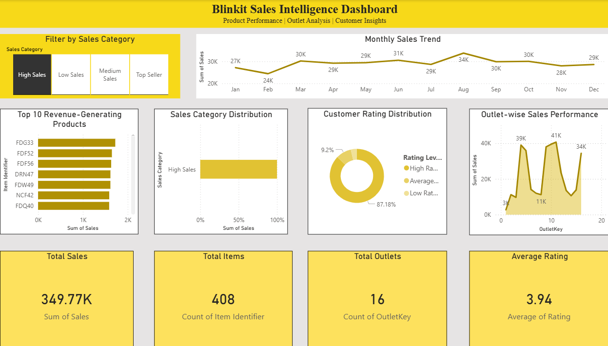

# 🛒 Blinkit Sales Intelligence Dashboard

> A single-page Power BI dashboard turning raw grocery-delivery data into fast, actionable sales insight — built with a Blinkit-yellow visual identity from the ground up.


🔗 **Repo:** [github.com/sanjyotdhamal/Blinkit-Dashboard](https://github.com/sanjyotdhamal/Blinkit-Dashboard)

---

## 🖼️ Dashboard Preview



> 📸 *Screenshot shows the full dashboard — KPI cards, monthly trend, top products, outlet performance, category split, and customer ratings all on one page.*

---

## 📌 Overview

**Blinkit Sales Intelligence Dashboard** is a one-page Power BI report that answers three core business questions at a glance:

- 💰 **How much are we selling, and to whom?**
- 🏪 **Which outlets and products are driving revenue?**
- ⭐ **How happy are our customers?**

The report is themed around Blinkit's signature yellow, giving it a clean, on-brand look while staying easy to scan during a stand-up or a stakeholder review.

---

## 📊 What's Inside

| Section | Visual | Purpose |
|---|---|---|
| 🧾 KPI Strip | Cards — Total Sales, Total Items, Total Outlets, Average Rating | At-a-glance health check |
| 📈 Trend | Line Chart — Monthly Sales Trend | Spot seasonality & momentum |
| 🏆 Products | Clustered Bar — Top Revenue-Generating Products | Know your bestsellers |
| 🏬 Outlets | Area Chart — Outlet-wise Sales Performance | Compare outlet contribution |
| 🗂️ Category Mix | 100% Stacked Bar — Sales Category Distribution | See category share of revenue |
| 😊 Customer Sentiment | Donut Chart — Customer Rating Distribution | Track service quality |
| 🎛️ Interactivity | Slicer — Filter by Sales Category | Slice every visual in one click |

All visuals are cross-filtered — click any category, outlet, or slicer item and the entire page reacts.

---

## 🛠️ Tech Stack

- **Power BI Desktop** — report authoring & data modeling
- **DAX** — aggregations and calculated measures
- **Power Query (M)** — data cleaning (`blinkit_cleaned_data`)

---

## 📁 Repository Structure

```
Blinkit-Dashboard/
├── blinkit_dashboard.pbix          # Main Power BI report file
├── README.md                       # You are here
└── screenshots/
    └── dashboard-overview.png      # Full-page dashboard screenshot
```

---

## 🚀 Getting Started

1. Clone the repo:
   ```bash
   git clone https://github.com/sanjyotdhamal/Blinkit-Dashboard.git
   ```
2. Open `blinkit_dashboard.pbix` in **Power BI Desktop** (2023 or later recommended).
3. Hit **Refresh** if you've swapped in your own dataset.
4. Explore — click the slicer, hover the charts, drill into what matters to you.

---

## 🔍 Key Insights the Dashboard Surfaces

- Which products are true revenue drivers vs. long-tail items
- Outlet-level performance gaps worth investigating
- Whether sales are concentrated in a few categories or well distributed
- The relationship between customer ratings and sales volume over time

---

## 🗺️ Roadmap

- [ ] Add a dedicated date/year slicer for multi-year comparisons
- [ ] Split into multi-page report (Product / Outlet / Customer views)
- [ ] Add Average Order Value and Sales-per-Outlet KPIs
- [ ] Publish to Power BI Service with scheduled refresh

---

## 👤 Author

**Sanjyot Dhamal**

---

⭐ If this project helped you understand Power BI dashboard design, consider giving it a star!